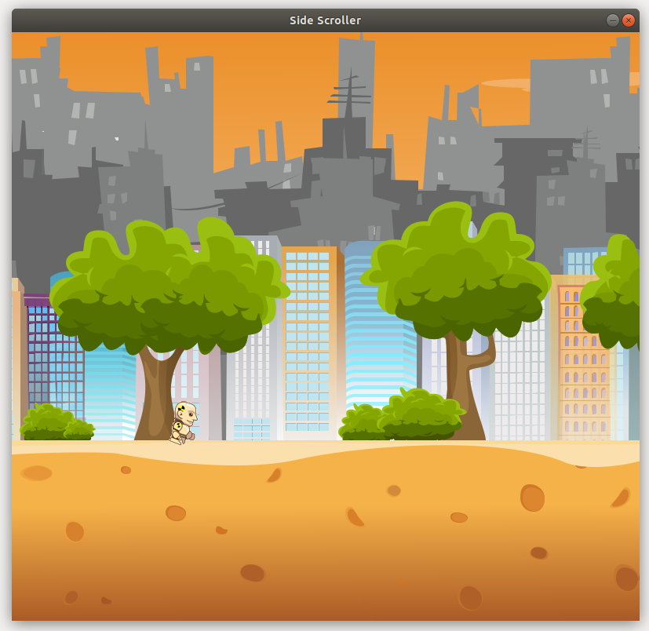

# sideScrollerGame
A side scrolling game using python.

## Building and Running the Project
To build and run this program you must navigate to where the files for the program are located. Next, make sure Python3 and Pygame is installed on your machine. Then in the Terminal window use the following command to run the program: `python3 main.py`

## Testing the Program
Currently, the program's code is checked by the .travis.yml file every time something is pushed to the project repository to see if it adheres to the PEP8 style guide and standards. The writing quality of the project is also checked using the travis.yml file using the Proselint tool. There are no other tests for the program, but test cases might be added to some functions of the program.

## Software/Developmental Tools Used
The primary tools used to develop this project were Atom, Python3, and .travis.yml. Atom was the text editor where all of the coding was performed. The programming language used for the program's development was Python3. The .travis.yml file checks every push made to the project to ensure they follow the PEP8 style guide and standards.

## Tangible Results
This project is still in development so there are not many tangible results. Currently, the player gains speed as the game runs. The player is also able to jump or slide, but objects still need to be added for the player to encounter because there is currently nothing that ends the game.

Here is an example of the program in action:

## Source for Images Used
Source for character: https://opengameart.org/content/running-and-jumping-kid-sprite-sheets

Source for background: https://opengameart.org/content/3-parallax-backgrounds

Source for box: https://opengameart.org/content/box-0

Source for bat: https://opengameart.org/content/bat
